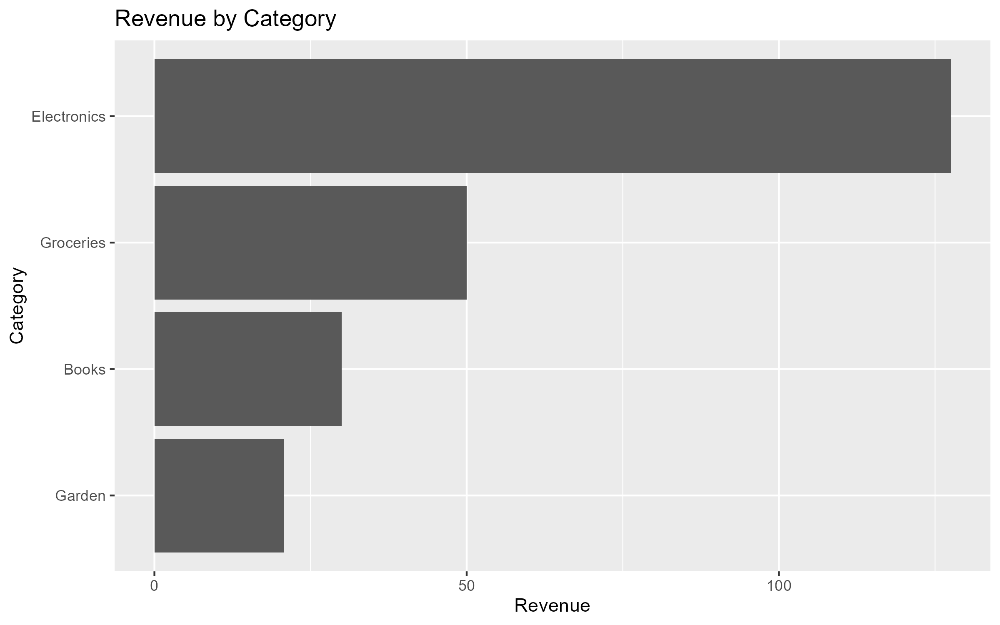
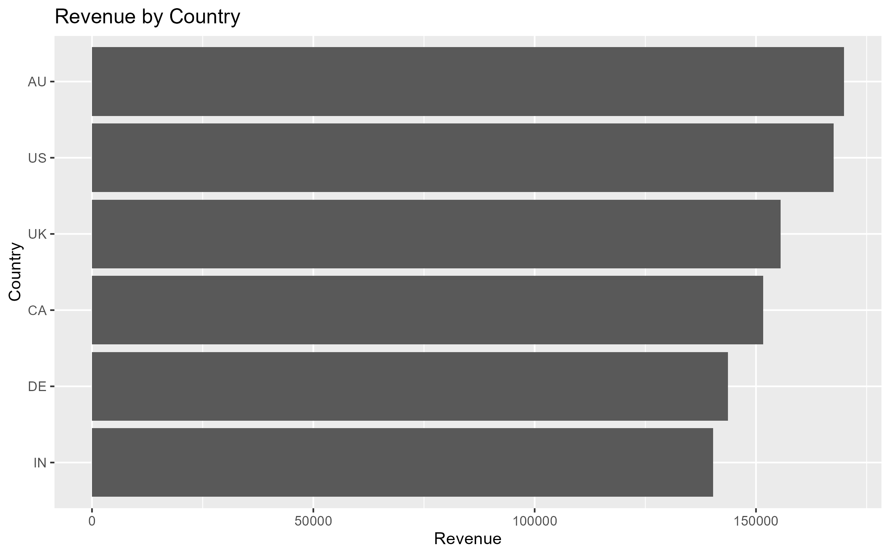
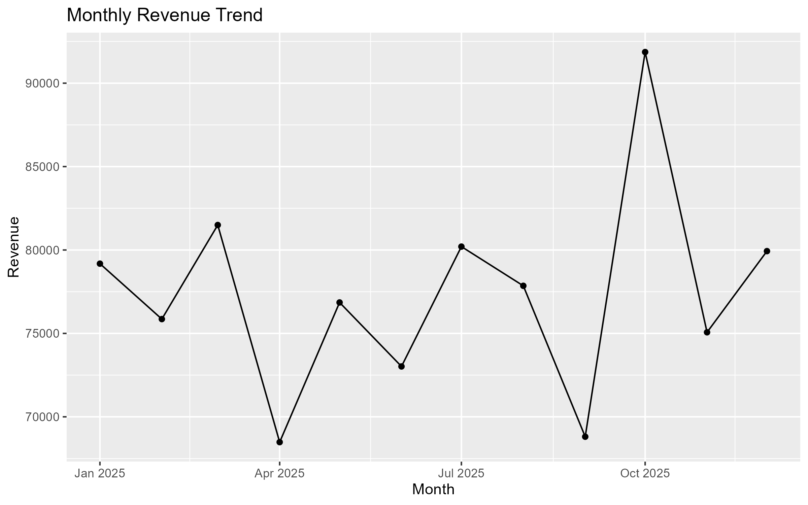
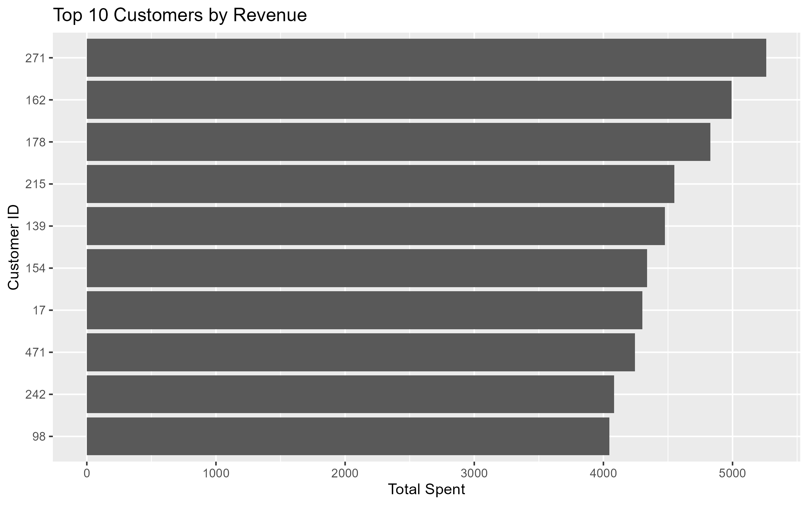

# Sales Analytics using R

A beginner-friendly sales analytics project built in R to explore customer purchases, revenue trends, product categories, and geographic performance.

The project demonstrates a complete data-analysis workflow using **R, dplyr, and ggplot2**, from data preparation and validation to aggregation, visualization, and business insights.

> **Note:** The dataset used in this project is synthetically generated for demonstration and learning purposes.

---

## Project Overview

This project analyzes a synthetic e-commerce sales dataset containing:

* **500 customers**
* **5,000 purchases**
* **10 product categories**
* **6 countries**
* Purchase data covering **January–December 2025**

The analysis focuses on understanding revenue performance across products, countries, months, and customers.

---

## Business Questions

The analysis answers the following questions:

* What is the total revenue and average purchase value?
* Which product categories generate the most revenue?
* Which countries contribute the most revenue?
* Which customers generate the highest revenue?
* How does revenue change over time?
* How concentrated is revenue among the highest-value customers?

---

## Analysis Pipeline

```text
Raw Customer & Purchase Data
            ↓
       Data Preparation
            ↓
        Table Join
            ↓
      Data Quality Checks
            ↓
       Data Transformation
            ↓
      Aggregation & Metrics
            ↓
        Business Analysis
            ↓
       Data Visualization
            ↓
       Processed Data Export
```

---

## Key Insights

### Overall Performance

* **Total revenue:** ₹928,625
* **Number of purchases:** 5,000
* **Average purchase value:** ₹186

### Category Performance

**Furniture** generated the highest revenue at approximately **₹276,668**, followed by **Electronics** at approximately **₹207,151**.

Together, these two categories contributed approximately **52% of total revenue**.

Furniture also had the highest average purchase value at approximately **₹557**.

### Country Performance

**Australia** generated the highest total revenue at approximately **₹169,868**.

The **United States** had the highest average purchase value at approximately **₹196**.

This highlights the difference between total revenue and average transaction value when evaluating geographic performance.

### Monthly Performance

**October** recorded the highest monthly revenue at approximately **₹91,866** and also had the highest average purchase value at approximately **₹216**.

April and September were among the lower-revenue months in the dataset.

### Customer Performance

The highest-value customer was **Customer 271**, who generated approximately **₹5,262** across 16 purchases.

The top 10 customers generated approximately **₹45,124**, representing **4.86% of total revenue**.

This indicates that revenue in this dataset is not heavily concentrated among a small number of customers.

---

## Visualizations

### Revenue by Category



### Revenue by Country



### Monthly Revenue Trend



### Top 10 Customers by Revenue



---

## Technologies Used

* **R**
* **tidyverse**

  * dplyr — data manipulation and aggregation
  * tibble — structured data creation
  * ggplot2 — data visualization
  * readr — CSV export
  * lubridate — date transformation

---

## Key R Concepts Demonstrated

This project uses several core R data-analysis concepts:

* `tibble()` for creating structured datasets
* `mutate()` for creating and transforming columns
* `case_when()` for conditional logic
* `left_join()` for combining related datasets
* `filter()` for data-quality validation
* `group_by()` and `summarise()` for aggregation
* `arrange()` for ranking results
* `n()` for counting observations
* `mean()` and `sum()` for calculating metrics
* `slice_head()` for selecting the highest-ranked records
* `ggplot()` for visualization
* `write_csv()` for exporting processed data

---

## Data Quality Checks

Before performing the analysis, the project checks for:

* Missing values
* Duplicate purchase IDs
* Invalid purchase amounts
* Purchases referencing non-existent customers

These checks help ensure that the analysis is performed on valid and consistent data.

---

## Project Structure

```text
sales-analytics-r/
│
├── data/
│   └── processed_sales.csv
│
├── plots/
│   ├── monthly_revenue.png
│   ├── revenue_by_category.png
│   ├── revenue_by_country.png
│   └── top_10_customers.png
│
├── sales_pipeline.r
├── .gitignore
└── README.md
```

---

## How to Run

### 1. Clone the repository

```bash
git clone https://github.com/sanmitha-23/sales-analytics-r.git
cd sales-analytics-r
```

### 2. Install the required R package

Open R or RStudio and run:

```r
install.packages("tidyverse")
```

### 3. Run the analysis

Execute:

```text
sales_pipeline.r
```

The script generates the synthetic customer and purchase data, performs the analysis, creates the visualizations, and exports the processed sales dataset.

---

## Reproducibility

The project uses:

```r
set.seed(123)
```

to make the randomly generated dataset reproducible.

Running the script again with the same environment will therefore generate the same dataset and analysis results.

---

## Learning Objective

The goal of this project was to build practical experience with the **R data-analysis workflow** rather than simply generating charts.

The project covers the complete process of:

**data preparation → validation → transformation → analysis → visualization → business interpretation**

---

## Disclaimer

This project uses a **synthetically generated dataset** created for educational and portfolio purposes. The revenue, customers, countries, categories, and transactions do not represent a real business.
